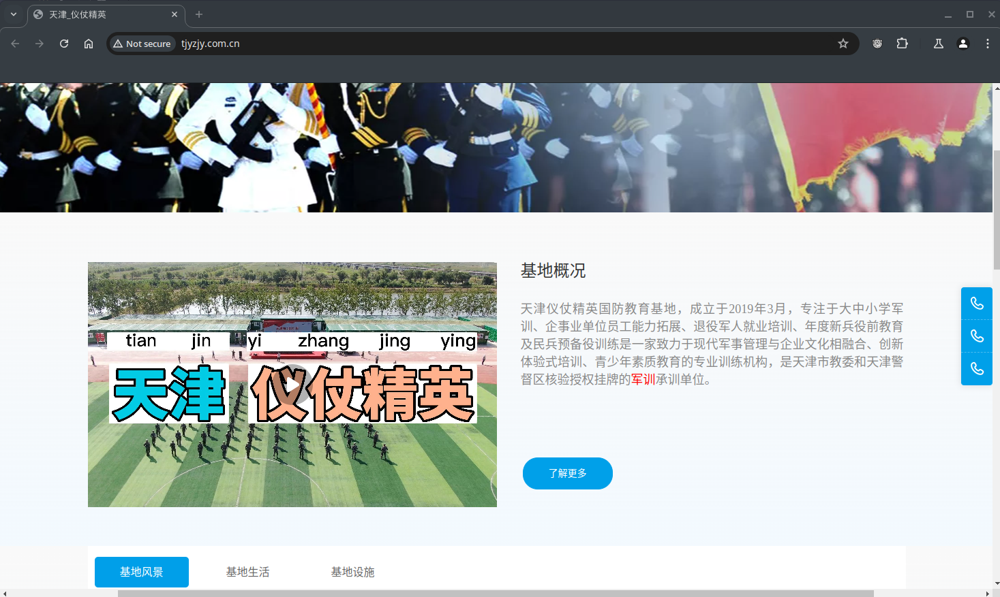

# 关于军训圈钱

> 该内容需要补充/核实
>> 部分内容暂时没有明确的证据, 有待进一步核实

> 没有记载私人事件
>> 没有记载关于个人的事件, 防止查水表.

## 目录

1. [军训协议](#军训协议)
2. [相关法律](#相关法律)
3. [证明在为军训缴费](#证明这是军训)
4. [未证实的信息](#其他未证实的信息)
5. [其他资料](#相关资料)

## 军训协议

> 提示
>> 交费 390RMB (交通费/服装费/讲解费/材料费/住宿费/餐费/保险费)

> 尊重事实
>> 既然提出了缴费, 那为什么不允许公开发表呢


## 相关法律

>《教育部等五部门关于2015年规范教育收费 治理教育乱收费工作的实施意见》

页面: [教育部官网 (gov.cn)](http://www.moe.gov.cn/srcsite/A01/s7048/201506/t20150616_190513.html)

明令禁止收 *军训费、住宿费、交通费、照相费* 等费用

### 原文

```text
六）进一步规范学校服务性收费和代收费行为

各地要严格遵守教育收费纪律，严格落实国家对各级各类学校服务性收费和代收费项目和收费标准的管理规定，
不得将教育教学活动、教学管理范畴内应免费提供服务的事项、国家已明确规定纳入公用经费开支或已明令禁止收取的项目列为服务性收费或代收费项目。
各地要组织开展对各级各类学校收费项目及收费标准进行清理检查，凡是与国家教育收费政策不一致的，应尽快废止或修订。
严禁越权设立收费项目、未经审批收费或突破已经审批的收费标准收费。严禁各级各类学校代收商业保险费，不得允许保险公司进校设点推销、销售商业保险。
严禁学校收取午休管理费（看护费），严禁学校在军训期间向学生收取军训费、住宿费、交通费、照相费等费用。
```

## 证明这是军训

> 缴费理由: 这是实践活动, 不是军训, 这是合法的

### 来自官网的证据

[天津_仪仗精英 (tjyzjy.com.cn)](http://www.tjyzjy.com.cn/)

[Web archive(部分地区打不开)]()

截图(已将关键词标红):



## 其他未证实的信息

- 洗澡只有五分钟
- 教官素质是差的, 河水是臭的

欢迎补充

## 相关资料

> 这里仅作资料收集, 不表达任何立场

- [Profile: 仪仗精英国防教育基地 (douyin.com)](https://v.douyin.com/i6UG9LHU/)
- [Video: 这不是军训，是去学农，大家千万避雷，千万别去！ (douyin.com)](https://v.douyin.com/i6UGkftd/)
